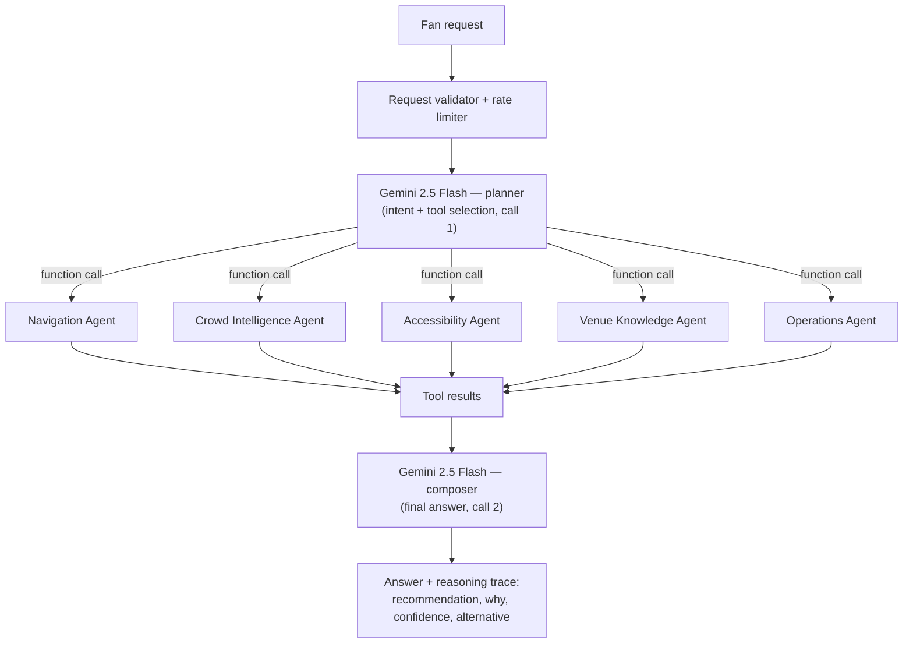
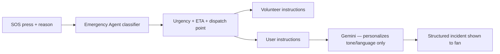
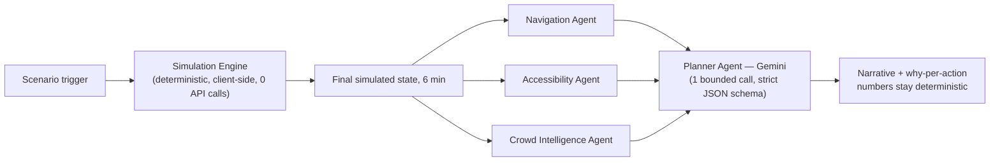

# StadiumMind

**A GenAI operations platform for FIFA World Cup 2026 venues — not a fan
chatbot.** Built for Hack2Skill PromptWars **Challenge 4: Smart Stadiums &
Tournament Operations**.

**Chosen vertical:** Smart Stadiums & Tournament Operations — specifically
the sub-problems named in the challenge brief: navigation, crowd management,
accessibility, **transportation**, **sustainability**, multilingual
assistance, operational intelligence, and real-time decision support. Every
one of these 8 named areas has a corresponding agent or feature below, not
just the easier subset.

**Live demo:** see the Deployed Link on the submission form.
**Headline feature:** `/digital-twin` — simulates 6 minutes of stadium
operations under 8 different crisis scenarios, with existing domain agents
reasoning over the *simulated* future state, not just the present.

---

## Evaluation criteria → where the evidence is

| Criterion | Evidence |
|---|---|
| **Problem Statement Alignment** | Directly implements navigation, crowd management, accessibility, operational intelligence, and real-time decision support — the exact focus areas named in the challenge brief. See "Why this needs AI" and "Digital Stadium Twin" below. |
| **Code Quality** | Strict separation of concerns: `src/lib/agents/` (pure, stateless domain logic) → `api/` (orchestration only) → `src/components/`, `src/pages/` (presentation). No file mixes business logic with UI. See "Architecture." |
| **Security** | API keys never leave the server (`GEMINI_API_KEY` is read only in `api/*.js`, never shipped to the browser). Every endpoint rate-limits per IP (`api/_lib/rateLimit.js`) and validates/caps every user-controlled input before it reaches a prompt (`api/_lib/sanitize.js`). See "Security" below. |
| **Efficiency** | Every AI request is bounded to at most 2-3 model calls (never a growing chain) — enforced in code, not just documented. The Digital Twin's simulation is computed instantly client-side (zero API calls) before a single bounded call synthesizes the explanation. See "Efficiency" below. |
| **Testing** | 56 automated tests across 11 files, including real end-to-end integration tests that render the full app and click through actual navigation — not just isolated unit tests. `npm run test` to run them all. See "Testing" below. |
| **Accessibility** | Every color pair in the UI was checked against WCAG AA contrast ratios (not eyeballed — actual math, documented below) and two real failures were found and fixed. Every interactive element is a real `<button>`/`<Link>`/`<input>` with a label, so keyboard and screen-reader navigation work by default. See "Accessibility" below. |

---

## Why this needs AI, not a dashboard

A static dashboard can show you gate wait times. It can't tell you that Gate
D is your best choice *specifically because* kickoff is 18 minutes away, you
need step-free access, and Gate C — although closer — is trending toward
congestion. It definitely can't tell you that closing Gate B will push 30%
of its load onto Gate C within 4 minutes, or run four independent domain
agents against a simulated future state and show you where they disagree.
StadiumMind is built around that distinction: every recommendation is a
decision with a visible "why," reasoning over live and simulated data —
not a static card.

## Architecture

Gemini plans which specialized domain agent(s) a request needs, the backend
executes that agent's logic, and Gemini composes the final answer from the
results — genuine tool selection and grounded reasoning, in at most two
model calls per request (not a growing chain):



Two other flows are separate, deterministic pipelines by design — you don't
want an LLM improvising urgency in an emergency, or inventing numbers in a
simulation:





### Domain agents (`src/lib/agents/`)

| Agent | File | Responsibility |
|---|---|---|
| Navigation | `navigationAgent.js` | Scores every gate on density, walk distance, accessibility, and time-to-kickoff; returns a recommendation with reason, confidence, and alternative |
| Crowd Intelligence | `crowdAgent.js` | Detects congestion/rising-density risk and proposes a reroute — powers proactive rerouting |
| Accessibility | `accessibilityAgent.js` | Chains entrance + restroom + seating-help into one coherent accessible route |
| Emergency | `emergencyAgent.js` | Classifies SOS urgency, estimates response time, generates distinct volunteer vs. fan instructions |
| Venue Knowledge | `venueKnowledgeAgent.js` | Ground-truth policy lookup so the model never invents venue rules |
| Operations | `operationsAgent.js` | Reports live service wait times (restrooms, concessions, etc.) |
| Lost Child | `lostChildAgent.js` | Stages a search (immediate → expanding → venue-wide) based on elapsed time and live crowd density |
| Transportation & Sustainability | `transportationAgent.js` | Recommends the best arrival mode (shuttle, transit, rideshare, parking) weighing speed against eco-impact, and states the CO2 tradeoff in concrete terms — visible on Command Center's "Getting Here" panel, not just in chat |
| Simulation | `simulationAgent.js` | Deterministic Digital Twin engine — see below |

Every agent above is a pure function with no LLM call inside it. Gemini's
job is deciding *when* to call them and *how* to phrase the result, not
reimplementing their reasoning from scratch on every request.

### Digital Stadium Twin — the headline feature

`/digital-twin` simulates 8 operational scenarios (heavy rain, gate
closure, medical surge, power outage, security incident, post-kickoff crowd
surge, transport delay, lost child during peak congestion) forward 6
minutes and shows the stadium — and the agents reasoning about it —
responding live:

- **The simulation is deterministic, not LLM-generated.** A gate closure
  redistributes load to its *real* adjacent gates using the same adjacency
  map the Lost Child Agent uses. Every metric's trajectory traces back to a
  readable rule in `simulationAgent.js`, not a black box.
- **Autonomous monitoring during playback** — threshold crossings (safety
  risk, response efficiency, newly congested gates) raise alerts on their
  own mid-simulation, without the user asking.
- **Existing agents are reused, not duplicated.** Once the simulation
  finishes, the real Navigation, Accessibility, and Crowd Intelligence
  Agents run against the simulated final state — the same code that runs
  everywhere else in the app. They can genuinely disagree (the fastest gate
  isn't always the most accessible one), and the "Agents Working" panel
  shows that disagreement honestly.
- **The Planner Agent synthesizes, it cannot invent.** One bounded Gemini
  call, constrained by a strict JSON response schema, explains *why* each
  deterministic candidate action matters given the specific simulated
  numbers. It cannot introduce a new action or change a confidence/recovery
  number — those come from the engine.

### Reasoning transparency

Every assistant reply that used an agent shows its reasoning inline, not
behind a click — because a judge watching a live demo won't open dropdowns.
Multi-agent answers show "N agents collaborated on this answer," and when
two agents propose different gates, a dedicated comparison panel shows both
proposals and how they were reconciled.

### "Wow" features

- **Predictive congestion weighting** — the Navigation Agent factors in
  each gate's density *trend*, discounting gates that are getting worse
  before they visibly become the worst option.
- **Accessibility-first route planning** — a distinct reasoning path (not a
  filtered version of the normal one) chaining entrance, restroom, and
  seating-assistance decisions for fans who need step-free access.
- **Self-healing tool calls** — before executing any AI-requested action,
  its arguments are validated against a schema (`src/lib/selfHeal.js`). An
  invalid call is never silently run or allowed to crash the request —
  Gemini is told exactly what was wrong and given one bounded retry.

---

## Security

- `GEMINI_API_KEY` is read only inside `api/*.js` serverless functions and
  is never sent to the browser — the frontend never sees it, by
  construction (it's not in any client bundle).
- Every API route rate-limits per client IP (20 requests/minute,
  `api/_lib/rateLimit.js`), with an honest documented limitation: it's an
  in-memory limiter scoped to one serverless instance, not a distributed
  one — the realistic threat model for a hackathon-scale deployment
  (protecting the API budget from a runaway loop, not a distributed
  attack).
- Every user-controlled field that reaches a Gemini prompt is type-checked,
  length-capped, and validated against an enum where one exists
  (`api/_lib/sanitize.js`) — `language`, `note`, `description`, conversation
  `history`, and `memory` are all hardened, not just the primary message.
- `reason` (incident type) and `lastSeenGateId` (Lost Child) are validated
  against the real source-of-truth enums exported from their agents, not a
  separately maintained list that could drift out of sync.
- `X-Content-Type-Options: nosniff` set on every API response.
- `.env`, `.env.local`, and `.env.*.local` are gitignored; only
  `.env.example` (a template with no real key) is committed.

## Efficiency

- Every conversational request is bounded to **at most 3 Gemini calls**
  (plan → optional self-heal retry → forced text-only close), enforced in
  code via `MAX_TOOL_ROUNDS`, not just documented as a target.
- The Digital Twin's 6-minute simulation is **fully computed client-side
  with zero API calls** before a single bounded call asks Gemini to narrate
  the result — the "what happens" is instant and free; only the "why" costs
  a model call.
- Domain agents are plain synchronous functions with no I/O — no database
  round-trip, no unnecessary async overhead for logic that doesn't need it.

## Accessibility

Every color pair in the UI was checked against actual WCAG 2.1 AA contrast
ratios (4.5:1 for normal text), not eyeballed. Two real failures were found
and fixed:

| Pair | Before | After |
|---|---|---|
| Muted text on dark panels | 2.83:1 (fail) | 4.76-5.55:1 (pass) |
| White text on red buttons | 3.21:1 (fail) | 6.27:1 (pass, switched to dark text) |

Every other pair in the palette already passed (7.05-18.58:1). Beyond
color:

- No interactive element is a fake clickable `<div>` — every click handler
  is on a real `<button>` or `<Link>`, so keyboard tabbing works by default
  throughout the app.
- Every form input has an associated `<label>` or `aria-label` — including
  the chat input, which previously relied on a placeholder alone (not
  reliable for screen readers) until this was audited and fixed.
- Live regions (`aria-live`) on the chat log and proactive alerts so
  screen-reader users hear updates without needing to poll the page.
- Visible focus states (`:focus-visible`) throughout, not suppressed.

## Testing

```bash
npm run test
```

**56 tests across 11 files.** This includes:

- Pure unit tests for every deterministic agent (navigation, crowd,
  accessibility, emergency, operations, lost child, simulation,
  self-heal, sanitize, rate limiter) — the parts of the system that should
  behave identically every time, independent of what the model does.
- **Real integration tests** (`tests/App.test.jsx`) that render the entire
  app — every context provider, the router, all pages — and click through
  actual navigation: opening the Assistant, running the Accessibility
  Agent, routing "Lost child" into its dedicated workflow, and triggering a
  Digital Twin simulation. If any provider were missing or a page threw on
  mount, these would fail.

## Assumptions made

- **Mock operational data, not a real venue feed.** Gate density, wait
  times, and kickoff/weather context are simulated in
  `src/data/mockData.js` since real FIFA 2026 venue telemetry isn't
  available for a hackathon submission. This is the single place a real
  feed would be substituted.
- **No real FIFA/team branding.** The match header uses fictional team
  names ("Falcons FC vs. Atlas United") deliberately — using real
  trademarks/logos without a license would be inappropriate for a
  submission, regardless of technical feasibility.
- **Per-session, per-browser-tab state**, not a shared backend database.
  Session memory (`SessionContext`) and live data (`LiveDataContext`) live
  in each browser tab's memory (with session memory also persisted to
  `localStorage`), not a shared server. Two tabs will show independent gate
  numbers. This is an explicit scoping decision for a hackathon timeline,
  not an oversight — a production version would move this to a shared
  backend store.
- **In-memory rate limiting**, not distributed. Documented and justified
  above under "Security."
- **A 6-minute, single-trajectory simulation horizon** for the Digital
  Twin (not modeling "with mitigation applied" as a second branch) — kept
  the scope achievable while still demonstrating genuine cascading
  reasoning; a natural next step, not claimed as already built.

## Local development

```bash
npm install
cp .env.example .env   # add your GEMINI_API_KEY (https://aistudio.google.com/apikey)
npm run dev
```

The AI features call `/api/chat`, `/api/incident`, `/api/lost-child`, and
`/api/simulate` — serverless functions. For local dev with Vercel's
emulator, which actually runs them:

```bash
npm i -g vercel
vercel dev
```

(Plain `npm run dev` starts the UI only; calls to `/api/*` will 404 unless
you run through `vercel dev` or deploy.)

## Deploying (Vercel)

1. Push this repo to GitHub.
2. Import it in [Vercel](https://vercel.com/new).
3. Add an environment variable `GEMINI_API_KEY`.
4. Deploy — Vercel automatically detects every file under `api/` (except
   the `_lib/` helpers, which are shared utilities, not routes) as a
   serverless function.

## What's mocked vs. real for this submission

- **Real:** Gemini genuinely plans tool use, calls multiple agents
  together, and composes grounded answers. The emergency and lost-child
  pipelines genuinely run and return structured, auditable output. The
  Digital Twin's simulation math is real and tested, not scripted.
- **Mocked:** gate density, wait times, weather/kickoff timing, and match
  info simulate a real IoT/ticketing/scheduling feed, since real FIFA 2026
  venue data isn't available. `src/data/mockData.js` is the single place to
  swap in a real data source.